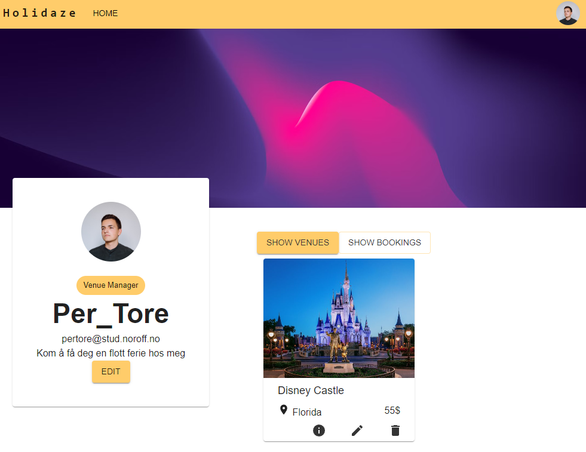

[](https://github.com/StineNygren/stine_nygren_exam_2/actions/workflows/e2e-testing.yml)

<div id="header" align="center">
  
</div>

## Description
A online hotel site were you can

- Search trough venues
- Create your owne venue
- Book a venue
- Edit your profile or venues

## Built With

- Type script
- React
- MUI
- Redux

## Getting Started

1. Installing:
```
npm i
```

2. Build:
```
npm run build
```
